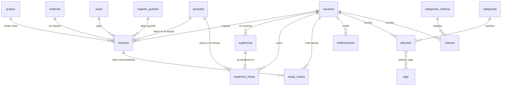
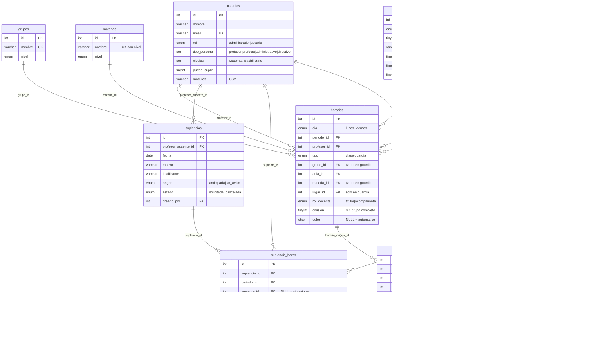

# 4. Base de datos

> Motor: **MySQL 8** / MariaDB 10.6+ · Motor de tablas **InnoDB** · Juego de caracteres
> **`utf8mb4`** en todas las tablas.
> Esquema canónico: [`database/database.sql`](../database/database.sql).
> Reglas de mantenimiento de los archivos SQL: [`database/CLAUDE.md`](../database/CLAUDE.md).

19 tablas repartidas en cinco dominios:

| Dominio | Tablas |
|---|---|
| **Identidad** | `usuarios` |
| **Catálogos académicos** | `periodos`, `grupos`, `materias`, `aulas`, `lugares_guardia` |
| **Operación académica** | `horarios`, `suplencias`, `suplencia_horas`, `swap_clases`, `eventos` |
| **Contenido editorial** | `articulos`, `categorias`, `tags`, `articulo_tags`, `noticias`, `categorias_noticias`, `testimoniales` |
| **Transversal** | `notificaciones` |

---

## 4.1 Diagrama entidad-relación

### Vista general



### Núcleo académico en detalle

Es la parte con la lógica no evidente. `horarios` es la tabla central: la consultan el módulo de
Horarios, el algoritmo de suplencias y los intercambios.



---

## 4.2 Tres invariantes que gobiernan todo el esquema

Antes del diccionario, tres reglas sin las cuales el diseño no se entiende.

### a) La jornada es **por nivel**, y la disponibilidad se calcula **por reloj**

`periodos` no es una jornada única para todo el colegio: tiene columna `nivel` y
`UNIQUE (nivel, orden)`. Cada nivel entra, sale y descansa a su hora, y hay profesores que dan
clase en varios.

> **Consecuencia:** dos clases **no** chocan por compartir `periodo_id`, chocan por **solaparse en
> el tiempo**. La «3ª hora» de Primaria y la «3ª hora» de Secundaria son identificadores distintos
> que se pisan en el reloj.

Quien decide qué significa «se pisan» es `Periodo::solapan()`, con criterio estricto: fin 08:40 +
inicio 08:40 **no** se solapan (no hay margen de traslado). De ahí cuelgan `Horario::libreEn()`,
`Horario::choques()` y `SuplenciaHora::sugerir()`.

Un bloque dura **45 minutos** en Maternal y Kinder, y **50** en el resto. Por eso las reglas de
descanso se miden en **minutos** (`SuplenciaHora::DESCANSO_MIN = 40`) y no en bloques: «una hora
libre» no es comparable entre jornadas.

### b) `horarios` perdió sus índices únicos, y es deliberado

Queda solo `uq_clase (dia, periodo_id, profesor_id, grupo_id, division)`. El horario real del
colegio tiene tres situaciones que hacían imposibles los UNIQUE de profesor, aula y grupo:

| Situación | Qué comparten las filas | Qué cambia | Columna que lo expresa |
|---|---|---|---|
| **Coteaching** | día, periodo, grupo, materia | el profesor | `rol_docente` (`titular` / `acompanante`) |
| **Materia dividida** | día, periodo, grupo | la asignatura y el subgrupo | `division` (1..n) |
| **Clase conjunta** | día, periodo, profesor, aula | el grupo | (misma hora, distinto `grupo_id`) |

> **La validación de choques vive entera en la aplicación** (`Horario::choques()`), que compara
> por reloj y sabe distinguir estos tres casos de un conflicto real. Un *trigger* no serviría:
> devolvería a MySQLi un error genérico y el importador de CSV no podría decir **qué fila** falló
> ni **por qué**.

### c) Las guardias de receso viven en `horarios`, no en una tabla propia

Una guardia es `tipo = 'guardia'`, con `lugar_id` apuntando a `lugares_guardia`, `grupo_id` y
`materia_id` a `NULL`, sobre un periodo con `es_receso = 1`.

> No es un atajo. Así `ocupacionDiaDeVarios()`, `libreEn()` y el algoritmo de suplencias la cuentan
> como ocupación **sin ningún caso especial** —a nadie se le asigna una suplencia mientras vigila el
> patio— y una guardia se puede suplir igual que una clase.

---

## 4.3 Diccionario de datos

Notación: **PK** clave primaria · **FK** clave foránea · **UK** parte de un índice único ·
*NN* obligatorio.

---

### `usuarios`

Personal del colegio con acceso al panel. **Es también la tabla del registro público** del sitio
(modelo `Usuario`, flujo `/cuenta/*`), aunque hoy ese flujo apenas se usa.

| Columna | Tipo | Nulo | Descripción |
|---|---|---|---|
| `id` | `INT UNSIGNED` **PK** | NN | |
| `nombre` | `VARCHAR(120)` | NN | Nombre completo tal y como aparece en directorios y horarios |
| `email` | `VARCHAR(180)` **UK** | NN | Identificador de acceso al panel |
| `password` | `VARCHAR(255)` | NN | Hash **bcrypt** (`password_hash`, `PASSWORD_BCRYPT`). Nunca en claro |
| `rol` | `ENUM('administrador','usuario')` | NN | `administrador` accede a todos los módulos; `usuario` solo a los de `modulos` |
| `rol_redaccion` | `ENUM('revisor','editor')` | SÍ | Sub-rol editorial. Solo aplica con el módulo `redaccion`; `NULL` en los demás |
| `tipo_personal` | `SET('profesor','prefecto','administrativo','directivo')` | SÍ | Papel en la operación académica. `prefecto` y `directivo` son **excluyentes**: no se combinan con nada, ni entre sí. `profesor` + `administrativo` sí es válido |
| `niveles` | `SET('Maternal','Kinder','Primaria','Secundaria','Bachillerato')` | SÍ | Fuente **declarativa** de en qué niveles imparte. Solo para `profesor`; `NULL` forzado en el resto. Es opcional: sin declarar, se infiere de sus clases |
| `puede_suplir` | `TINYINT(1)` | NN, def. `1` | `0` = «no puede suplir a otros profesores». Solo lo decide un administrador |
| `modulos` | `VARCHAR(255)` | SÍ | CSV de módulos para el rol `usuario` (ej. `redaccion,suplencias`). `NULL` en administradores |
| `fecha_nacimiento` | `DATE` | SÍ | Calendario interno de cumpleaños. **No** está en `$columnasDB`: se persiste con `guardarFechaNacimiento()` para poder guardar `NULL` real |
| `avatar` | `VARCHAR(255)` | SÍ | Ruta pública de la foto |
| `ultimo_acceso` | `DATETIME` | SÍ | Se actualiza en cada login correcto |
| `creado_en` | `TIMESTAMP` | NN | `DEFAULT CURRENT_TIMESTAMP` |

**Índices:** `PRIMARY (id)` · `uq_email (email)`

> ⚠️ **`niveles` solo aplica a profesores.** `UsuarioBlog::normalizarNiveles()` lo fuerza a `NULL`
> en cualquier otro tipo, así que un POST manipulado tampoco se lo cuela a un prefecto.

---

### `periodos`

La jornada escolar, **una por nivel**.

| Columna | Tipo | Nulo | Descripción |
|---|---|---|---|
| `id` | `INT UNSIGNED` **PK** | NN | |
| `nivel` | `ENUM(5 niveles)` **UK** | NN | Nivel al que pertenece esta jornada |
| `orden` | `TINYINT UNSIGNED` **UK** | NN | Posición dentro de la jornada de **su** nivel |
| `etiqueta` | `VARCHAR(40)` | NN | Texto visible: «1ª hora», «Receso» |
| `hora_inicio` | `TIME` | NN | |
| `hora_fin` | `TIME` | NN | |
| `es_receso` | `TINYINT(1)` | NN, def. `0` | `1` = descanso, no es clase. Es donde se agendan las guardias |

**Índices:** `PRIMARY (id)` · `uq_nivel_orden (nivel, orden)`

---

### `grupos`

| Columna | Tipo | Nulo | Descripción |
|---|---|---|---|
| `id` | `INT UNSIGNED` **PK** | NN | |
| `nombre` | `VARCHAR(80)` **UK** | NN | Ej. `3A Primaria` |
| `nivel` | `ENUM(5 niveles)` | NN | Debe coincidir con el nivel del `periodo_id` de sus clases |

> **No hay columna de orden.** El listado sale de `Materia::ordenNivel()` (el `FIELD()` que ordena
> Maternal → Bachillerato) y, dentro de cada nivel, del nombre.

---

### `materias`

| Columna | Tipo | Nulo | Descripción |
|---|---|---|---|
| `id` | `INT UNSIGNED` **PK** | NN | |
| `nombre` | `VARCHAR(120)` **UK** | NN | El nivel **no** va en el nombre |
| `nivel` | `ENUM(5 niveles)` **UK** | NN | |

**Índices:** `uq_materia (nombre, nivel)`

> El `UNIQUE` compuesto es necesario: «Arte» de Kinder y «Arte» de Primaria son materias distintas
> y antes se pisaban en silencio al importar el CSV.

---

### `aulas` y `lugares_guardia`

Ambas con la misma forma: `id` **PK** y `nombre VARCHAR(80)` **UK**. `aulas` son los espacios de
clase; `lugares_guardia` los sitios donde se vigila en el receso (patio, comedor, pasillos).

---

### `horarios`

**La tabla central del sistema.** Una fila = la ocupación de **un** profesor en **un** día y **un**
periodo. Un mismo bloque real de clase puede ocupar varias filas (coteaching, clase conjunta).

| Columna | Tipo | Nulo | Descripción |
|---|---|---|---|
| `id` | `INT UNSIGNED` **PK** | NN | |
| `dia` | `ENUM('lunes'…'viernes')` **UK** | NN | Sin fin de semana |
| `periodo_id` | `INT UNSIGNED` **FK** **UK** | NN | → `periodos.id`, `ON DELETE CASCADE`. Determina el nivel y el reloj |
| `profesor_id` | `INT UNSIGNED` **FK** **UK** | NN | → `usuarios.id`, `ON DELETE CASCADE` |
| `tipo` | `ENUM('clase','guardia')` | NN, def. `clase` | |
| `grupo_id` | `INT UNSIGNED` **FK** **UK** | SÍ | → `grupos.id`, `ON DELETE SET NULL`. `NULL` en guardias |
| `aula_id` | `INT UNSIGNED` **FK** | SÍ | → `aulas.id`, `ON DELETE SET NULL` |
| `materia_id` | `INT UNSIGNED` **FK** | SÍ | → `materias.id`, `ON DELETE SET NULL`. `NULL` en guardias |
| `lugar_id` | `INT UNSIGNED` **FK** | SÍ | → `lugares_guardia.id`, `ON DELETE SET NULL`. **Solo** en `tipo='guardia'` |
| `rol_docente` | `ENUM('titular','acompanante')` | NN, def. `titular` | Coteaching. Ambos tienen la hora ocupada |
| `division` | `TINYINT UNSIGNED` **UK** | NN, def. `0` | `0` = la clase es de todo el grupo. `1..n` = opciones simultáneas de una materia dividida |
| `color` | `CHAR(7)` | SÍ | Color del bloque elegido a mano en el editor. `NULL` = automático, derivado del nombre de la materia |

**Índices:**
`PRIMARY (id)` · `uq_clase (dia, periodo_id, profesor_id, grupo_id, division)` ·
`idx_prof_dia (profesor_id, dia)` ← lo usa `ocupacionDiaDeVarios()` ·
`idx_grupo_dia (grupo_id, dia)`

**Claves foráneas:** `fk_hor_periodo` · `fk_hor_profesor` (ambas `CASCADE`) ·
`fk_hor_grupo` · `fk_hor_aula` · `fk_hor_materia` · `fk_hor_lugar` (las cuatro `SET NULL`)

> ⚠️ **El CSV de horarios no transporta el color**, y una importación reemplaza el horario
> completo de los profesores del archivo. Por eso `importarHorarios()` fotografía
> `(profesor, día, periodo) → color` con `Horario::coloresDeProfesores()` **antes** del borrado y
> lo vuelca en las filas nuevas.

---

### `suplencias`

Una fila = **la ausencia de un profesor en una fecha**. Las horas concretas viven en
`suplencia_horas`.

| Columna | Tipo | Nulo | Descripción |
|---|---|---|---|
| `id` | `INT UNSIGNED` **PK** | NN | |
| `profesor_ausente_id` | `INT UNSIGNED` **FK** | SÍ | → `usuarios.id`, `SET NULL` |
| `fecha` | `DATE` | NN | Día de la ausencia. Base del cálculo del ciclo del justificante |
| `motivo` | `VARCHAR(160)` | SÍ | Texto libre, pero el formulario ofrece el catálogo `Suplencia::MOTIVOS` + «Otro» |
| `notas` | `TEXT` | SÍ | Contexto adicional para quien coordina |
| `justificante` | `VARCHAR(255)` | SÍ | Ruta del PDF o imagen. Máx. 50 MB (`MAX_JUSTIFICANTE_MB`) |
| `justificante_subido_en` | `DATETIME` | SÍ | |
| `justificante_resuelto_en` | `DATETIME` | SÍ | Cuándo se decidió qué hacer con él |
| `justificante_resuelto_por` | `INT UNSIGNED` **FK** | SÍ | → `usuarios.id`, `SET NULL`. **La resolución va firmada** |
| `justificante_resolucion` | `ENUM('descargado','eliminado','purgado')` | SÍ | |
| `origen` | `ENUM('anticipada','sin_aviso')` | NN, def. `anticipada` | `sin_aviso` exige justificante |
| `estado` | `ENUM('solicitada','agendada','en_curso','por_justificar','completada','cancelada')` | NN, def. `solicitada` | Lo recalcula `Suplencia::recalcularEstado()` a partir de sus horas |
| `creado_por` | `INT UNSIGNED` **FK** | SÍ | Quién abrió la ausencia: el propio profesor o prefectura |
| `creado_en`, `actualizado_en` | `TIMESTAMP` | NN | `actualizado_en` con `ON UPDATE CURRENT_TIMESTAMP` |

**Índices:** `idx_fecha (fecha)` · `idx_estado (estado)` ·
`idx_justif_cola (justificante_resuelto_en, fecha)` ← sirve la cola de justificantes

#### Ciclo de vida del justificante — retención 7 / 30 días

El archivo vive en una carpeta pública y suele ser un parte médico, así que **no se conserva
indefinidamente**. La cuenta arranca en `fecha` (el día de la ausencia), no en la subida: lo que
caduca es la necesidad de revisarlo.

| Días desde la ausencia | Estado derivado | Quién actúa |
|---|---|---|
| 0 – 7 (`DIAS_DESCARGA`) | `vigente` — se descarga desde la suplencia | Cualquiera que coordine |
| 8 – 29 | `en_cola` — espera decisión en `/dashboard/suplencias/justificantes` | Dirección o prefectura: descargar o eliminar |
| ≥ 30 (`DIAS_PURGA`) | `purgado` — se borra solo | Nadie |

> **El estado se deriva, no se guarda.** `Suplencia::estadoJustificante()` lo calcula a partir de
> la fecha, para que no envejezca mal si nadie entra al panel en una semana. La **resolución** sí
> se guarda y va firmada: el histórico tiene que distinguir «nunca hubo justificante» de «lo hubo
> y se resolvió así».

---

### `suplencia_horas`

Cobertura hora a hora. Cada periodo a cubrir puede tener su propio suplente y su propia
validación.

| Columna | Tipo | Nulo | Descripción |
|---|---|---|---|
| `id` | `INT UNSIGNED` **PK** | NN | |
| `suplencia_id` | `INT UNSIGNED` **FK** | NN | → `suplencias.id`, `ON DELETE CASCADE` |
| `periodo_id` | `INT UNSIGNED` **FK** | NN | → `periodos.id`, `CASCADE` |
| `grupo_id`, `aula_id`, `materia_id` | `INT UNSIGNED` **FK** | SÍ | Copia de los datos de la clase, `SET NULL` |
| `tipo` | `ENUM('clase','guardia')` | NN, def. `clase` | Una guardia de receso también se suple |
| `lugar_id` | `INT UNSIGNED` **FK** | SÍ | → `lugares_guardia.id`, `SET NULL` |
| `suplente_id` | `INT UNSIGNED` **FK** | SÍ | → `usuarios.id`, `SET NULL`. `NULL` = hora sin asignar |
| `estado_hora` | `ENUM('pendiente','agendada','validada','no_cubierta')` | NN, def. `pendiente` | |
| `validado_en` | `DATETIME` | SÍ | |
| `incumplio_id` | `INT UNSIGNED` **FK** | SÍ | Quién no se presentó |
| `incumplido_en` | `DATETIME` | SÍ | |
| `recordatorio_en` | `DATETIME` | SÍ | Marca anti-duplicado del aviso «confirma si cubriste» |

**Índices:** `idx_suplencia (suplencia_id)` · `idx_suplente (suplente_id)` ·
`idx_pendientes (suplente_id, estado_hora)` ← lo usa el recordatorio de coberturas vencidas

> ⚠️ **`incumplio_id` es una columna aparte de `suplente_id` a propósito.** Al reasignar la hora a
> otro profesor, `suplente_id` cambia; el incumplimiento tiene que seguir imputado a quien no
> llegó, o desaparecería de las estadísticas.

> **`no_cubierta` no es `pendiente`.** `pendiente` es una hora que nadie ha tomado todavía;
> `no_cubierta` es una incidencia con responsable. Devolverla al circuito es un paso aparte y
> deliberado (`/dashboard/suplencias/reabrir-hora`).

---

### `swap_clases`

Intercambio **puntual** entre dos profesores: no altera el horario permanente, solo dice qué pasa
esos dos días concretos. Por eso cada lado guarda la pareja `(horario_id, fecha)`.

| Columna | Tipo | Nulo | Descripción |
|---|---|---|---|
| `id` | `INT UNSIGNED` **PK** | NN | |
| `solicitante_id` | `INT UNSIGNED` **FK** | NN | → `usuarios.id`, `CASCADE` |
| `destinatario_id` | `INT UNSIGNED` **FK** | NN | → `usuarios.id`, `CASCADE` |
| `horario_origen_id` | `INT UNSIGNED` **FK** | SÍ | Clase que el solicitante no puede dar. `SET NULL` |
| `fecha_origen` | `DATE` | NN | El día concreto en que falta |
| `horario_destino_id` | `INT UNSIGNED` **FK** | SÍ | Clase que se ofrece a cambio. `SET NULL` |
| `fecha_destino` | `DATE` | NN | |
| `motivo` | `VARCHAR(255)` | SÍ | |
| `estado` | `ENUM('pendiente','aceptado','rechazado','validado','denegado','cancelado')` | NN, def. `pendiente` | |
| `respuesta_nota` | `VARCHAR(255)` | SÍ | Por qué se rechaza o se deniega |
| `respondido_en` | `DATETIME` | SÍ | |
| `validado_por` | `INT UNSIGNED` **FK** | SÍ | Prefectura o dirección. `SET NULL` |
| `validado_en` | `DATETIME` | SÍ | |
| `creado_en` | `TIMESTAMP` | NN | |

**Índices:** `idx_swap_solicitante (solicitante_id, estado)` ·
`idx_swap_destinatario (destinatario_id, estado)` · `idx_swap_estado (estado, fecha_origen)`

> `Swap::DIAS_VENTANA = 7` limita el margen: las clases que se pueden pedir a cambio son las del
> otro profesor dentro de los 7 días siguientes. Más allá deja de ser un intercambio y es un
> cambio de horario.

---

### `eventos`

| Columna | Tipo | Nulo | Descripción |
|---|---|---|---|
| `id` | `INT UNSIGNED` **PK** | NN | |
| `fecha` | `DATE` | NN | |
| `fecha_fin` | `DATE` | SÍ | Para eventos de varios días |
| `tipo` | `ENUM('festivo','evento','junta','entrega','suspension')` | NN, def. `evento` | |
| `titulo` | `VARCHAR(160)` | NN | |
| `descripcion` | `TEXT` | SÍ | |
| `audiencia` | `ENUM('interno','familias','estudiantes')` | NN, def. `interno` | **Excluyente.** `interno` no sale del panel; los otros dos se publican además en la sección de Comunidad correspondiente |
| `niveles` | `SET(5 niveles)` | SÍ | Vacío = todo el colegio |
| `creado_en` | `TIMESTAMP` | NN | |

**Índices:** `idx_fecha (fecha)` · `idx_audiencia (audiencia)`

> `Evento::normalizarNiveles()` guarda `NULL` también cuando están marcados los cinco: para quien
> lee el calendario son la misma cosa, y así la interfaz no pinta cinco chips redundantes.
> Todos los eventos, sea cual sea su audiencia, aparecen en el calendario del panel.

---

### `notificaciones`

Avisos de **cualquier** módulo, no solo de Redacción.

| Columna | Tipo | Nulo | Descripción |
|---|---|---|---|
| `id` | `INT UNSIGNED` **PK** | NN | |
| `usuario_id` | `INT UNSIGNED` **FK** | NN | → `usuarios.id`, `ON DELETE CASCADE` |
| `modulo` | `VARCHAR(40)` | NN, def. `general` | Fija el icono de la fila |
| `tipo` | `VARCHAR(60)` | NN | Clave semántica del evento |
| `nivel` | `ENUM('info','exito','aviso','error')` | NN, def. `info` | Fija el color y el título del modal |
| `referencia_id` | `INT UNSIGNED` | SÍ | Id del registro relacionado |
| `referencia_tipo` | `VARCHAR(40)` | SÍ | Era un `ENUM('articulo','noticia')`; se abrió a `VARCHAR` al hacerse transversales |
| `enlace` | `VARCHAR(255)` | SÍ | **Destino del «Ver»**, guardado y no deducido: suplencias abre en `/agendar`, no en `/editar` |
| `mensaje` | `VARCHAR(255)` | NN | |
| `leida` | `TINYINT(1)` | NN, def. `0` | |
| `creado_en` | `TIMESTAMP` | NN | |

**Índices:** `idx_usuario_leida (usuario_id, leida)`

> ⚠️ **Marcar como leída = BORRAR.** No se archiva nada. La red de seguridad es un «Deshacer» de
> 6 segundos: el `DELETE` se ejecuta de inmediato y la respuesta devuelve la fila completa, que el
> cliente reinserta si el usuario se arrepiente. Se borra primero y se restaura después —en vez de
> diferir el `DELETE`— para que recargar o cerrar la pestaña a mitad de la cuenta atrás no deje
> basura.

---

### Contenido editorial

#### `articulos` y `noticias`

Estructura casi idéntica. Difieren en que `noticias` tiene `portada` / `portada_alt` (en vez de
`imagen`) y un flag `destacada`.

| Columna | Tipo | Descripción |
|---|---|---|
| `id` | `INT UNSIGNED` **PK** | |
| `titulo` | `VARCHAR(255)` NN | |
| `slug` | `VARCHAR(280)` **UK** NN | URL pública |
| `extracto` | `VARCHAR(300/400)` | Resumen para listados y meta description |
| `contenido` | `LONGTEXT` | HTML del editor |
| `imagen` / `portada` | `VARCHAR(255)` | Ruta de la imagen destacada |
| `estado` | `ENUM('borrador','publicado','programado')` | Los `programado` se publican solos al visitarse el listado |
| `envio_revision` | `TINYINT(1)` | `1` = esperando aprobación de un revisor |
| `comentario_revision` | `TEXT` | Motivo del rechazo |
| `version_pendiente` | `LONGTEXT` | Borrador de una entrada **ya publicada**, a la espera de aprobación |
| `destacada` | `TINYINT(1)` | Solo en `noticias`. Una sola a la vez |
| `fecha_publicacion` | `DATETIME` | Programación |
| `tiempo_lectura` | `TINYINT UNSIGNED` | Minutos estimados |
| `vistas`, `likes` | `INT` | Contadores |
| `categoria_id` | **FK** | → `categorias` / `categorias_noticias`, `SET NULL` |
| `autor_id` | **FK** | → `usuarios`, `SET NULL` |
| `creado_en`, `actualizado_en` | `TIMESTAMP` | |

#### `categorias` y `categorias_noticias`

`id` · `nombre VARCHAR(60)` · `slug VARCHAR(80)` **UK** · `color CHAR(7)` (def. `#4267ac`) ·
`descripcion VARCHAR(240)` · `creado_en`.

> El color debe salir de la **paleta institucional de 10 colores** documentada en `CLAUDE.md`.

#### `tags` y `articulo_tags`

`tags`: `id` · `nombre VARCHAR(60)` · `slug VARCHAR(80)` **UK**.
`articulo_tags`: tabla puente con **PK compuesta** `(articulo_id, tag_id)` y ambas FK en `CASCADE`.
Es la única relación muchos-a-muchos del esquema.

#### `testimoniales`

`id` · `nombre VARCHAR(100)` · `rol ENUM('Papá','Mamá','Exalumno','Exalumna','Familia')` ·
`comentario TEXT` · `aprobado TINYINT(1)` · `created_at TIMESTAMP`.

> Alimentada por el formulario público `/feedback-testimoniales`. No se publica hasta que un
> revisor la aprueba. Es la única tabla con nombres de columna en inglés (`created_at`) —
> incoherencia heredada.

---

## 4.4 Procedimientos almacenados, triggers y eventos

**No hay ninguno.** Ni procedimientos, ni funciones, ni triggers, ni eventos programados. Toda la
lógica vive en PHP.

Verificación sobre una base cargada:

```sql
SELECT ROUTINE_NAME, ROUTINE_TYPE FROM information_schema.ROUTINES
 WHERE ROUTINE_SCHEMA = 'colegiobilbao';                       -- 0 filas

SELECT TRIGGER_NAME FROM information_schema.TRIGGERS
 WHERE TRIGGER_SCHEMA = 'colegiobilbao';                       -- 0 filas

SELECT EVENT_NAME FROM information_schema.EVENTS
 WHERE EVENT_SCHEMA = 'colegiobilbao';                         -- 0 filas
```

### Por qué, y qué hace ese trabajo en su lugar

| Lógica que un trigger podría hacer | Dónde vive realmente | Motivo |
|---|---|---|
| Impedir que dos clases choquen | `Horario::choques()` / `conflictos()` | Un trigger devolvería a MySQLi un error genérico; el importador de CSV tiene que decir **qué fila** falló y **por qué**, y distinguir coteaching y materia dividida de un choque real |
| Recalcular el estado de una suplencia al cambiar sus horas | `Suplencia::recalcularEstado()`, invocado tras cada escritura | Necesita conocer el contexto de la acción (quién y desde qué pantalla) para emitir además la notificación correcta |
| Purgar justificantes vencidos | `BlogController::purgarJustificantes()`, disparado por `home()` | Hay que **borrar el archivo del disco**, no solo la fila. Un trigger no puede tocar el sistema de archivos |
| Avisar al suplente de una cobertura sin confirmar | `BlogController::recordarCoberturasVencidas()`, disparado por `home()` | Ídem: escribe en `notificaciones` con enlace y nivel calculados en aplicación |
| Publicar contenido programado | `Articulo::publicarProgramados()` en cada visita al blog | |

### Automatismos que sí están en el esquema

Lo único que la base de datos hace por su cuenta:

| Mecanismo | Dónde | Efecto |
|---|---|---|
| `DEFAULT CURRENT_TIMESTAMP` | `creado_en` de casi todas las tablas | Sella el alta |
| `ON UPDATE CURRENT_TIMESTAMP` | `actualizado_en` de `articulos`, `noticias`, `suplencias` | Sella la modificación |
| `ON DELETE CASCADE` | `horarios` (periodo, profesor), `suplencia_horas` → `suplencias`, `articulo_tags`, `notificaciones`, `swap_clases` (ambos profesores) | Borrado en cascada de los dependientes |
| `ON DELETE SET NULL` | Catálogos y autorías (grupo, aula, materia, lugar, suplente, categoría, autor) | Borrar un aula no borra el horario: lo deja sin aula |

> **El criterio de la cascada:** `CASCADE` cuando el hijo **no existe** sin el padre (una hora de
> suplencia sin suplencia no significa nada); `SET NULL` cuando el hijo sobrevive con un dato
> menos (una clase sin aula sigue siendo una clase).

### Sin cron

No hay tareas programadas de ningún tipo. Los tres procesos de mantenimiento cuelgan de la carga
del panel — ver [arquitectura §1.10](01-arquitectura.md#110-tareas-periódicas-sin-cron).

---

## 4.5 Los tres archivos SQL

**Solo existen tres.** No hay migraciones ni parches, y no se crean archivos nuevos: si el esquema
cambia se edita `database.sql` y se ajustan los dos de datos.

```
database/
├── database.sql                  ESTRUCTURA — DROP + CREATE, cero datos
├── credenciales.md               cuentas del seed y sus contraseñas
├── CLAUDE.md                     reglas de estos archivos
├── deploy/deploy.sql             PRODUCCIÓN — solo INSERT de registros reales
└── development/development.sql   DESARROLLO — solo INSERT, datos de prueba
```

| Archivo | Contiene | No contiene |
|---|---|---|
| `database.sql` | Todas las tablas con índices y FKs | Ningún `INSERT` |
| `deploy.sql` | Claustro real, catálogos académicos, categorías, tags y artículos publicados | Horarios, suplencias, eventos, noticias ni testimoniales |
| `development.sql` | Todo lo anterior **más** cuentas de prueba, una semana de horarios, ~90 suplencias y contenido ficticio | — |

> **Por qué `deploy.sql` no lleva horarios ni suplencias:** son datos operativos que en producción
> genera el propio panel. Los horarios entran por CSV; las suplencias las abren prefectura y el
> claustro. Sembrarlos ensuciaría la base real.

### Orden de ejecución

Siempre la estructura primero y después **un solo** archivo de datos:

```bash
# Desarrollo
mysql -u root -p colegiobilbao < database/database.sql
mysql -u root -p colegiobilbao < database/development/development.sql

# Producción
mysql -u root -p colegiobilbao < database/database.sql
mysql -u root -p colegiobilbao < database/deploy/deploy.sql
```

Nunca los dos archivos de datos seguidos: comparten identificadores y chocarían.

> ⚠️ **`database.sql` reactiva `FOREIGN_KEY_CHECKS` en la ÚLTIMA línea, no arriba.** El archivo
> abre con `SET FOREIGN_KEY_CHECKS = 0` y los `DROP TABLE`, y solo vuelve a `= 1` al final. Si se
> reactivan antes de los `CREATE`, cualquier FK ajena que apunte a estas tablas aborta el script a
> mitad, **dejando las tablas ya borradas**. No mover esa línea.

---

## 4.6 Comprobaciones de integridad

Estas consultas codifican los invariantes del dominio. **Todas deben devolver `0`.** Son la mejor
base disponible para una futura suite de pruebas; la versión completa, con las excepciones de
coteaching y materia dividida ya escritas, está en
[`database/CLAUDE.md`](../database/CLAUDE.md).

```sql
-- (a) ninguna clase apunta a un periodo de otro nivel
SELECT COUNT(*) FROM horarios h
  JOIN periodos p ON p.id = h.periodo_id
  JOIN grupos   g ON g.id = h.grupo_id
 WHERE h.tipo = 'clase' AND p.nivel <> g.nivel;

-- (b) ninguna clase cae sobre un receso
SELECT COUNT(*) FROM horarios h JOIN periodos p ON p.id = h.periodo_id
 WHERE h.tipo = 'clase' AND p.es_receso = 1;

-- (c) ninguna guardia cae fuera de un receso
SELECT COUNT(*) FROM horarios h JOIN periodos p ON p.id = h.periodo_id
 WHERE h.tipo = 'guardia' AND p.es_receso = 0;

-- (f) ningún acompañante sin titular en su bloque
--     (fila huérfana: no sale en el editor, así que nadie puede borrarla,
--      pero le sigue ocupando la hora a esa persona)
SELECT COUNT(*) FROM horarios a
 WHERE a.rol_docente = 'acompanante' AND NOT EXISTS (
   SELECT 1 FROM horarios t
    WHERE t.rol_docente = 'titular' AND t.dia = a.dia
      AND t.periodo_id = a.periodo_id AND t.division = a.division
      AND t.grupo_id <=> a.grupo_id AND t.materia_id <=> a.materia_id);

-- (g) ningún no-profesor con niveles declarados
SELECT COUNT(*) FROM usuarios
 WHERE niveles IS NOT NULL AND NOT FIND_IN_SET('profesor', tipo_personal);

-- (h) ningún módulo asignado fuera de la lista blanca
--     (la lista canónica es UsuarioBlog::MODULOS_ASIGNABLES)
SELECT id, nombre, modulos FROM usuarios
 WHERE modulos IS NOT NULL AND modulos <> ''
   AND NOT (modulos REGEXP '^(usuarios|profesores|prefectura|administrativos|directivos|eventos|horarios|aulas|grupos|suplencias|swaps|redaccion|soporte)(,(usuarios|profesores|prefectura|administrativos|directivos|eventos|horarios|aulas|grupos|suplencias|swaps|redaccion|soporte))*$');
```

Las consultas de choque de profesor, grupo y aula —más largas, porque llevan escritas las
excepciones de las tres convivencias legítimas— están en `database/CLAUDE.md`.

---

## 4.7 Probar un cambio de esquema sin romper nada

Cargar los archivos en una base desechable antes de tocar la real:

```bash
mysql -u root -e "DROP DATABASE IF EXISTS cb_test; CREATE DATABASE cb_test CHARACTER SET utf8mb4;"
mysql -u root cb_test < database/database.sql
mysql -u root cb_test < database/development/development.sql
mysql -u root cb_test -e "SELECT COUNT(*) FROM usuarios;"
mysql -u root -e "DROP DATABASE cb_test;"
```

Los dos archivos de datos deben cargar **sin un solo *warning*** sobre el `database.sql` actual.
Si uno falla, el esquema y el seed se han desincronizado.

---

## 4.8 Respaldos

El proyecto **no incluye automatización de respaldos**: es responsabilidad del servidor. Volcado
completo recomendado:

```bash
mysqldump -u root -p --single-transaction --routines --triggers \
          --default-character-set=utf8mb4 colegiobilbao > backup-$(date +%F).sql
```

Restauración:

```bash
mysql -u root -p colegiobilbao < backup-2026-08-11.sql
```

> **Los justificantes y las imágenes subidas NO están en la base de datos**: las filas solo
> guardan la ruta. Un respaldo completo debe incluir también `public/build/assets/{blog,noticias,usuarios,suplencias}/`.
